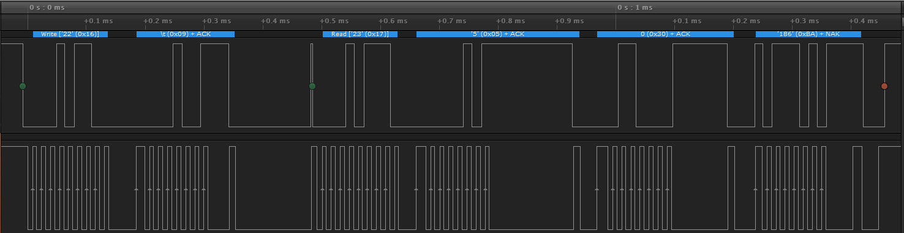
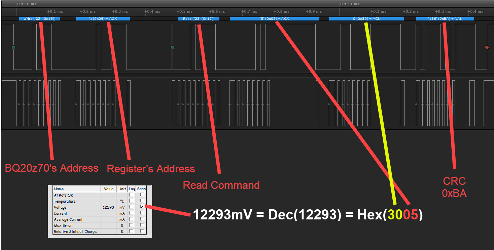

# Reverse Engineering BQ20z70 Laptop BMS
In this repository, I will talk about how I have reverse-engineered the communication protocol of the BQ20z70 Laptop BMS and how I got the full control of it.

# Why I am doing this work ??
I noticed that many lithium battery recyclers throwing the BMS boards in the garbage, although they are important and could be recycled also. I have noticed that you will find little information about how to reuse the laptop BMS on the internet (Because it needs experience and it could bring lots of money !), so I am doing this to encourage the community to share their experience and help each other. This repository is the result of studying more than 15 laptop BMS boards and experimenting with them.


# Introduction
The BMS is an electronic system that manages a rechargeble battery (cell or battery pack), such as by protecting the battery and monitoring its state, balancing each individual cell, and making sure that it operates within the safe operating area.

Features that the BMS provides:
```
1- Reports the appropriate charging current needed for constant current charging and the appropriate charging voltage needed for constant voltage charging to a smart charger using SMBus broadcasts.
2- Determines the chemical state of charge of each battery cell using Impedance Track™ and can reduce the charge difference of the battery cells in fully charged state of the battery pack gradually using cell balancing algorithm during charging. This prevents fully charged cells from overcharging and causing excessive degradation and also increases the usable pack energy by preventing premature charge termination.
3- Supports pre-charging/zero-volt charging.
4- Support fast charging.
5- Supports charge inhibit and charge suspend if battery pack temperature is out of temperature range.
6- Reports charging fault and also indicate charge status via charge and discharge alarms.
```

The BMS might also has a communication protocol that enables controlling it using any embedded system, also the embedded system could read many internal registers inside the BMS such as:

```
1- The voltage for each individual cell.
2- The voltage of the pattery pack
3- The current (Positive value for charging, Negative for discharging, and zero for idle).
4- The temperature of the battery pack.
5- Estimated time to full (when charging).
6- Estimated Time to empty (when discharging).
7- Full charge capacity.
8- Remaining capacity.
9- Cycle count.
10- Absolute/Relative state of charge.
11- Charging voltage.
12- Charging current.
14- Battery status flags.
15- Mosfets status.
16- Charging status.

and more ....
```

The Laptop BMS is controlled using the [SMBus](https://en.wikipedia.org/wiki/System_Management_Bus) protocol, its special type of I²C bus with (Low frequency speed ≃ 10KHz and it might requires low value pull up resistor such as 1.2 KOhm for both the clock and data lines). The computer uses this protocol to control the BMS and also could read its basic info.

We can do lots of projects using the BMS such as:
```
1- DIY power walls (using lithium batteries for storing solar energy) and monitoring each battery pack.
2- DIY electric scooters.
3- DIY electric cars and robots.
4- Battery backuped devices, power banks, and UPSs.

So many applications ..
```

Once the battery is used too many times, its life degrades by the usage and once the BMS detects that one of the cells is damaged, it locks down the battery and prevents any further charging/discharging process.

# Disclaimer
**Warning:** Laptop batteries are so dangerous, they contain high energy and could be exploded if you make any mistake with them or damage any device that connected with them. I am not responsible for any damages or injuries that occurs with anyone, you are doing this with your own risk.

# Safety First!!
When dealing with lithium batteries, you will need to keep them in well cleaned environment (Keeping the batteries far from any metal object), Keep the batteries in well protected boxes, keep them far from any liquids, use proper safety tools for handling and containing lithium fires, keep the batteries far from childrens, and use proper tools for protecting your own computer such as:
```
1- Using USB isolators for isolating the computer from the microcontroller that connected to the battery.
2- Make sure to fasten all your wires and keeping them intact.
```

# Getting Started

After doing some researches on my single cell BMS kit (its on my previous repository) [BQ27500EVM_Reverse_Engineering
](https://github.com/rxtxinv/BQ27500EVM_Reverse_Engineering), I discovered that I could use the EV2300 SMBus interface to read my laptop BMS information and also controling it.

This is the BMS that I am using currently:


By searching with the IC's name, we will find its datasheet [here](https://www.ti.com/product/BQ20Z70-V160)

In the datasheet we will find the system block diagram of the BMS:


The BMS is based on BQ20z70 BMS IC, and also contains a BQ29330 analog front end (AFE) IC so it could read all of the voltages of the cells, providing balancing feature for all cells, and it provides multible layers of protection (for increasing realability) such as:
```
1- Over/Under voltage protection for each cell.
2- Over current charge/discharge protection.
3- Short circuit protection.
3- Over temperature protection for charging and discharging.
4- Impalance protection.
5- Over charging protection.
```

# How To Identify The SMBus Pins On The BMS
Its easy to identify both of (Data, Clock) pins. In some cases, it might be written on the board under each pin like this (for example):


| BMS Board  | Explanation  |
| ------------- | ------------- |
| P+  | Pack's positive pin  |
| P+  | Pack's positive pin  |
| D  | SMBus-Data  |
| C  | SMBus-Clock  |
| ID  | Detection pin for the laptop to identify the insertion of the battery  |
| B/I  | Unknown for now |
| P-  | Pack's negative pin  |
| P-  | Pack's negative pin |

The other method is nothing written on the BMS board, you will need to use the multimeter to trace both of the (Data, Clock) pins [You have to disconnect the batteries from the BMS].

Now after understanding how the BMS works, its time to connect it to the ([EV2300](https://www.ti.com/lit/ug/sluu159e/sluu159e.pdf?ts=1628836111764) or [EV2400](https://www.ti.com/tool/EV2400)) and inserting the logic analyzer inline with them for sniffing the protocol.


The connection diagram:


# Sniffing the BQ20z70's protocol ( The Dump Way )
The logic analyzer is one of the most useful tools. Its simply sniffs the communication protocol, decodes it, and record it. I have connected the logic analyzer inline with the EV2300 and the BMS like the picture above, after that I have installed the [evaluation software for the BQ20z70](https://www.ti.com/lit/zip/sluc105) it works (on Windows7 and earlier versions).

I have opened the software, it has identified the BMS without any problems and we got lots of information regarding the BQ20z70 BMS.

Press the (+) buttons and choose I2C

This image shows all the registers of the BQ20z70, We will read each register separately using the logic analyzer and analyze it using the logic analyzer, after that we will link those information with the already readed value using the evaluation software.

## Preparing The Logic Analyzer To Capture SMBus
Here are the settings for setting the Logic analyzer, press the (+) button and choose I2C


The following window will appear, choose the correct channels.
I have connected the logic analyzer as follows:


| Logic Analyzer's Pin Number | Logic Analyzer | BQ20z70 BMS  |
| ------------- | ------------- | ------------- |
| 1  | Channel 0  | SMBus_Data |
| 2  | Channel 1  | SMBus_Clock  |
| 3  | Channel 2  | Not Connected  |
| 4  | Channel 3  | Not Connected  |
| 5  | Channel 4  | Not Connected  |
| 6  | Channel 5  | Not Connected |
| 7  | Channel 6  | Not Connected  |
| 8  | Channel 7  | Not Connected  |
| 9  | GND  | GND  |
| 10  | GND  | Not Connected  |

After that we will choose the **[Falling Edge Triggering]** for the Clock's pin


Press Start, the logic analyzer will wait for the the clock signal to be low ( Reveived SMBus Data).


Example:

We will scan the voltage reading by putting the **[✓]** mark on the voltage only and press **[Refresh]**


The logic analyzer will get the captured Data:


Also we will get the voltage reading on the program:


After analyzing the SMBus Frame, we will got the following result:


```
The BQ20z70's Address is: 0x16.
The Battery Pack's Voltage register Address is: 0x09 (See the following section for more info).
The readed voltage in the BQ Evaluation Software -> Voltage = Dec(12293mV) = Hex(0x3005).
Calculated CRC = 0xBA ( will be discussed later )
```

Here is the captured data ( you could open it using [Saleae Logic 1.2.18](https://downloads.saleae.com/logic/1.2.18/Logic+Setup+1.2.18.exe) )

* [Reading Voltage Register 0x09](SMBus_Capture/Reading_Voltage_Register_0x09/Reading_Voltage_Register_0x09.logicdata)

# Calculating the CRC
As we saw earlier, the BQ20z70 supports CRC as a Packet Error Checking (PEC) mechanism for SMBus frames. Its simply applies the following equation for calculating the CRC:


I have found a C code [here](https://stackoverflow.com/questions/57923291/finding-polynomial-used-in-crc-8-calculation-table) for calculating the CRC, it could be used later in our code.

* [CRC_Calculation](CRC_Calculation)

```C
#include <stdio.h>
#include <stdlib.h>
#include <stdint.h>

// Original link for the code
// https://stackoverflow.com/questions/57923291/finding-polynomial-used-in-crc-8-calculation-table

#define FrameLength 5

static const uint8_t crc_table[] = {
 0x00, 0x07, 0x0e, 0x09, 0x1c, 0x1b, 0x12, 0x15, 0x38, 0x3f, 0x36, 0x31,
 0x24, 0x23, 0x2a, 0x2d, 0x70, 0x77, 0x7e, 0x79, 0x6c, 0x6b, 0x62, 0x65,
 0x48, 0x4f, 0x46, 0x41, 0x54, 0x53, 0x5a, 0x5d, 0xe0, 0xe7, 0xee, 0xe9,
 0xfc, 0xfb, 0xf2, 0xf5, 0xd8, 0xdf, 0xd6, 0xd1, 0xc4, 0xc3, 0xca, 0xcd,
 0x90, 0x97, 0x9e, 0x99, 0x8c, 0x8b, 0x82, 0x85, 0xa8, 0xaf, 0xa6, 0xa1,
 0xb4, 0xb3, 0xba, 0xbd, 0xc7, 0xc0, 0xc9, 0xce, 0xdb, 0xdc, 0xd5, 0xd2,
 0xff, 0xf8, 0xf1, 0xf6, 0xe3, 0xe4, 0xed, 0xea, 0xb7, 0xb0, 0xb9, 0xbe,
 0xab, 0xac, 0xa5, 0xa2, 0x8f, 0x88, 0x81, 0x86, 0x93, 0x94, 0x9d, 0x9a,
 0x27, 0x20, 0x29, 0x2e, 0x3b, 0x3c, 0x35, 0x32, 0x1f, 0x18, 0x11, 0x16,
 0x03, 0x04, 0x0d, 0x0a, 0x57, 0x50, 0x59, 0x5e, 0x4b, 0x4c, 0x45, 0x42,
 0x6f, 0x68, 0x61, 0x66, 0x73, 0x74, 0x7d, 0x7a, 0x89, 0x8e, 0x87, 0x80,
 0x95, 0x92, 0x9b, 0x9c, 0xb1, 0xb6, 0xbf, 0xb8, 0xad, 0xaa, 0xa3, 0xa4,
 0xf9, 0xfe, 0xf7, 0xf0, 0xe5, 0xe2, 0xeb, 0xec, 0xc1, 0xc6, 0xcf, 0xc8,
 0xdd, 0xda, 0xd3, 0xd4, 0x69, 0x6e, 0x67, 0x60, 0x75, 0x72, 0x7b, 0x7c,
 0x51, 0x56, 0x5f, 0x58, 0x4d, 0x4a, 0x43, 0x44, 0x19, 0x1e, 0x17, 0x10,
 0x05, 0x02, 0x0b, 0x0c, 0x21, 0x26, 0x2f, 0x28, 0x3d, 0x3a, 0x33, 0x34,
 0x4e, 0x49, 0x40, 0x47, 0x52, 0x55, 0x5c, 0x5b, 0x76, 0x71, 0x78, 0x7f,
 0x6a, 0x6d, 0x64, 0x63, 0x3e, 0x39, 0x30, 0x37, 0x22, 0x25, 0x2c, 0x2b,
 0x06, 0x01, 0x08, 0x0f, 0x1a, 0x1d, 0x14, 0x13, 0xae, 0xa9, 0xa0, 0xa7,
 0xb2, 0xb5, 0xbc, 0xbb, 0x96, 0x91, 0x98, 0x9f, 0x8a, 0x8d, 0x84, 0x83,
 0xde, 0xd9, 0xd0, 0xd7, 0xc2, 0xc5, 0xcc, 0xcb, 0xe6, 0xe1, 0xe8, 0xef,
 0xfa, 0xfd, 0xf4, 0xf3
};

uint8_t crc8(uint8_t *p, uint8_t len)
{
    uint16_t i;
    uint16_t crc = 0x0;

    while (len--) {
            i = (crc ^ *p++) & 0xFF;
            crc = (crc_table[i] ^ (crc << 8)) & 0xFF;
    }

    return crc & 0xFF;
}

void PrintArray(uint8_t *p, uint8_t len)
{
    printf("{ ");
    for(int i=0;i<len;i++)
    {
        printf("0x%02X ", p[i]);
    }
    printf("} \n");
}

int main()
{
    /* BQ20z70's Address: 0x16
     * Register's Address: 0x09
     * Read Command: 0x05
     * Register's data (Low): 0x05
     * Register's data (High): 0x30
     */
    uint8_t data[FrameLength] = {0x16,0x09,0x17,0x05,0x30}; // Calculate CRC for these values
    printf("Input Data = ");
    PrintArray(data,FrameLength); // Print the contents of the array
    uint8_t crc;
    crc = crc8(data, FrameLength);   // Calculate the CRC
    printf("CRC = 0x%02X\n", crc);   // Print the CRC value
    return 0;
}

```
By running the previous example we get:


The calculated CRC is the same compared with the CRC value in the [Reading Voltage Register 0x09](SMBus_Capture/Reading_Voltage_Register_0x09/Reading_Voltage_Register_0x09.logicdata) capture.
# BQ20z70 Registers
After reading the datasheet and lots of files regarding the BQ20z70. I have found that the BQ20z70 contains registers that could be read/Written through SMBus Commands, they are well explained in **[page 47]** in [bq20z70-V160 + bq29330, bq20z75 Technical Reference Manual](https://www.ti.com/lit/er/sluu265a/sluu265a.pdf) PDF file, we will go through them quickly later.

The most important table for us at **[page 67 and 68]**, it shows us the register's name, it's address, it's format, and it's units.

We will use this table for writing our code.
# Project Status
* Documenting the project (Current task, Not completed yet).

# Useful Resources
Check the [BQ20z70](https://www.ti.com/product/BQ20Z70-V160) product's page.
## Datasheet
* [SBS 1.1 Compliant Gas Gauge Enabled w/Impedance Track Tech for bq29330 datasheet (Rev. B)](https://www.ti.com/lit/gpn/bq20z70-v160)
## Application Notes
* [Data Flash Programing and Calibrating the bq20zxx Family of Gas Gauges (Rev. E)](https://www.ti.com/lit/pdf/slua379)
* [Battery Pack Production Flow With bq20zXX](https://www.ti.com/lit/pdf/slua391)
* [Quick-Start Guide for bq20zxx Family Gas Gauges (Rev. A)](https://www.ti.com/lit/pdf/slua421)
* [BQ20z70 and BQ20z90 Application Book](https://www.ti.com/seclit/an/slua404/slua404.pdf)

## User Guide
* [bq20z70-V160 + bq29330, bq20z75 TRM](https://www.ti.com/lit/pdf/sluu310)
* [bq20z70-V160 + bq29330, bq20z75 Technical Reference Manual](https://www.ti.com/lit/er/sluu265a/sluu265a.pdf)
# Support Me
If you seen my work and it helped you, please support me on LinkedIn by endorsing my skills. It will be appreciated :grinning:.
<p>
  <a href="https://www.linkedin.com/in/omar-mekkawy/" rel="nofollow noreferrer">
    
  </a> &nbsp;
</p>
