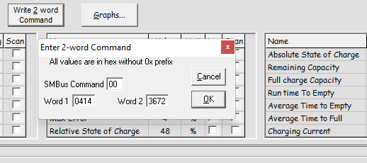

# Understanding the BQ20z70 Security

Unfortunately, one of the most **"annoying"** features of the BMS IC is that its protected **"Sealed"** with a 32bit key. Usually its sealed during the production in the factory.

**I might later try brute force attacking techniques to crack it.** so stay tuned.

# Disclaimer
**Warning:** Laptop batteries are so dangerous, they contain high energy and could be exploded if you make any mistake with them or damage any device that connected with them. I am not responsible for any damages or injuries that occurs with anyone, you are doing this with your own risk.
**Also I am not responsible of applying anything mentioned here in this repository. You are doing this on your own risk.**

# Why the BMS is locked with keys and secured ?
In this section I will talk about the BQ20z70 security and how to identify that the BMS is locked.

By default, when the BMS comes out of the factory. Its sealed with a 32bit key to ensure that no one can access the internal BMS configuration parameters. These parameters are stored in an internal flash memory and loaded into the RAM registers on power on. These parameters are so critical and cannot be changed except from the authorized persons. Any mistakes happens with these parameters could lead to BMS malfunction. As a result of playing wrongly with these parameters, it could make the battery pack **explode**.

# How to know that the BMS is sealed with password ?

Simply, the **OperationStatus(0x54)** register contains the security status bits **FAS** and the **SS**.

Sniffing the SMBus when Reading the **OperationStatus(0x54)** register:
* [Recorded logic analyzer's data](./DataCaptures/OperationStatus_Capture.logicdata)

refer to the [Calculating The CRC](../README.md#calculating-the-crc) section for more details.

The register mapping:

The bits status **Red = 1**, **Green = 0**

* **FAS** Full access security mode.
    * **Bit 14 FAS = 0** &rarr; The BMS in the Full-Access mode.
    * **Bit 13 FAS = 1** &rarr; The BMS not in the Full-Access mode.
* **SS** Sealed mode.
    * **SS=0** &rarr; The BMS is not sealed.
    * **SS=1** &rarr; The BMS is sealed.

As we can see from the previous image, the **FAS = 1** and **SS = 1** which means that the BMS is **sealed**.

# Unsealing the BMS
According to the [Quick-Start Guide for bq20zxx Family Gas Gauges](https://www.ti.com/lit/an/slua421a/slua421a.pdf) PDF file (Page 19). We can send the unseal command as follows:

The Word1 is sent first (0x0414)

Then, the Word2 is sent after Word1 (0x3672)

Once we send the command, We notice that the SS bit **SS=0** which means that the BMS is unsealed **(Fortunately the manufacturer used the default sealing keys from TI)**

Now, we send the full access command according to (page 20).

The Word1 is sent first (0xffff)

Then, the Word2 is sent after Word1 (0xffff)

Delay between Word1 and Word2 frames:

Once we send the command, We notice that the FAS bit **FAS=0** which means that the BMS in full access mode now **(Fortunately the manufacturer used the default full access keys from TI)**

**And finally the BMS in full access mode.**

# Useful Resources
* [Quick-Start Guide for bq20zxx Family Gas Gauges](https://www.ti.com/lit/an/slua421a/slua421a.pdf). This file contains all the procedures for sealing and unsealing the BMS.
* [bq20z70-V160 + bq29330, bq20z75 TRM](https://www.ti.com/lit/pdf/sluu310).
* [bq20z70-V160 + bq29330, bq20z75 Technical Reference Manual](https://www.ti.com/lit/er/sluu265a/sluu265a.pdf).
